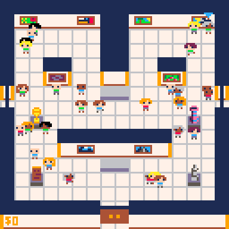
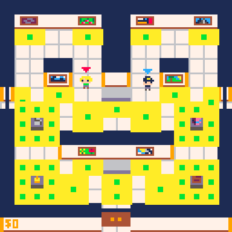
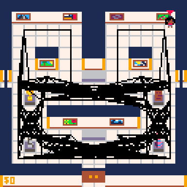
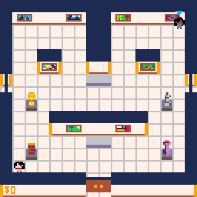

# Guard-And-Thief
Two-player hiding-in-plain-sight AI proof of concept.  

## AI Overview
The AI museum-goers in this proof-of-concept are designed to move in simple but realistic ways so that the art thief player can copy the AI's mannerisms to hide from the security guard player as one of the museum-goers. 
The GIF below shows the AI museum-goers wandering the museum.  

  

To allow for more realistic and varied movement for the AI, certain parts of the museum are designated as 'points of interest', like the areas near art pieces, exits, and high-traffic hallways. The AI moves to random points of interest to appear as if they are viewing art pieces, heading for exits, or waiting in hallways. 
The screenshot below depicts the points of interest in this museum. The yellow rectangles are the areas for each point of interest, and the green dots are the pathfinding nodes that the AI uses to navigate to these areas.  

  

When the program is first started, a graph is generated that includes every open path between the pathfinding nodes of every point of interest. 
The screenshot below depicts this graph.  

  

To determine where to move to next, the AI selects a random point of interest as the 'target' point of interest, and then chooses a random location in the area of that point of interest as the final destination. 
The AI then uses a uniform-cost search algorithm on the graph generated earlier to determine the shortest path between the point of interest closest to the starting location and the target point of interest, and then adds the starting location and final destination to the beginning and end of this path, respectively. This path is generated once at the beginning of movement. 
In order to follow this path, the AI moves towards the next location in the path one at a time. However, if the AI has a clear line of sight to a location further along in the path, the AI will skip locations on the path and will move towards the further location instead. This causes the AI to take smoother, more natural routes through the museum. 
The GIF depicts an AI museum-goer following a path through the museum. The green lines represent the path generated by the algorithm at the start of movement, and the yellow rectangle represents the AI's current target location to move towards.  

